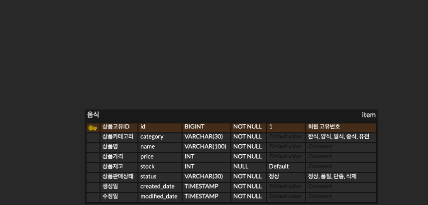

# delivery-service-project 
배달 서비스 프로젝트입니다.

### itemEntity(음식 엔티티)
| 한글명      | 영문명            | 설명                        |
|:---------|:---------------|:--------------------------|
| 상품 아이디   | itemId         | 상품의 고유 번호입니다.             |
| 상품 카테고리  | itemCategory   | 상품의 카테고리입니다.              |
| 상품명      | itemName       | 상품의 이름입니다.                |
| 상품 가격    | itemPrice      | 상품의 가격입니다.                |
| 상품 재고    | itemStock      | 상품의 재고입니다.                |
| 상품 판매 상태 | itemSaleStatus | 상품의 판매 상태(판매, 품절)를 나타냅니다. |
| 생성일      | createdDate    | 생성일입니다.                   |
| 수정일      | modifiedDate   | 수정일입니다.                   |

### 음식(item) API
| 요청         | HTTP Method | API                                   |
|:-----------|:------------|:--------------------------------------|
| 음식 전체 조회   | `GET`       | https://localhost:8080/items          |
| 음식 단일 조회   | `GET`       | https://localhost:8080/items/{itemId} |
| 음식 등록      | `POST`      | https://localhost:8080/items          |
| 음식 수정      | `PATCH`     | https://localhost:8080/items/{itemId} |
| 음식 전체 삭제   | `DELETE`    | https://localhost:8080/items          |
| 음식 개별 삭제   | `DELETE`    | https://localhost:8080/items/{itemId} |

### 음식(item) + 식당(shop) API
| 요청              | HTTP Method   | API                                                  |
|:----------------|:--------------|:-----------------------------------------------------|
| 한 식당의 음식 전체 조회  | `GET`         | https://localhost:8080/shops/{shopId}/items          |
| 한 식당의 음식 단일 조회  | `GET`         | https://localhost:8080/shops/{shopId}/items/{itemId} |
| 한 식당의 음식 등록     | `POST`        | https://localhost:8080/shops/{shopId}/items          |
| 한 식당의 음식 수정     | `PATCH`       | https://localhost:8080/shops/{shopId}/items/{itemId} |
| 한 식당의 음식 전체 삭제  | `DELETE`      | https://localhost:8080/shops/{shopId}/items          |
| 한 식당의 음식 개별 삭제  | `DELETE`      | https://localhost:8080/shops/{shopId}/items/{itemId} |

### 음식 API 클래스 다이어그램

### 음식 API ERD

