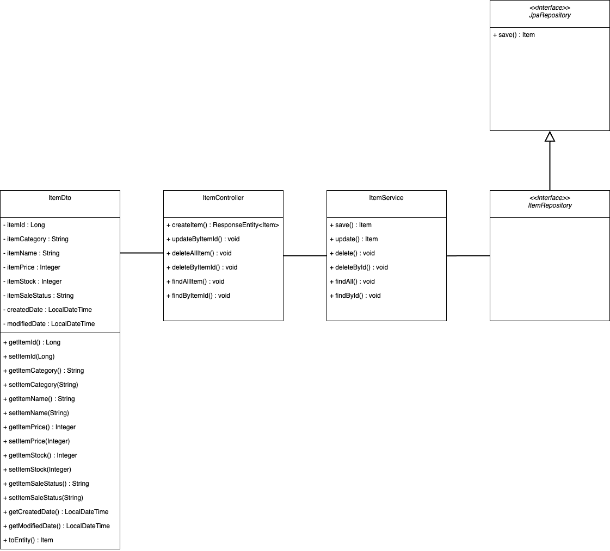
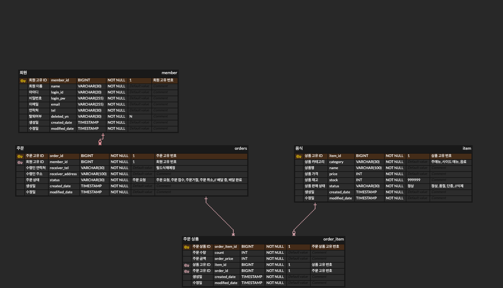

# delivery-service-project 
배달 서비스 프로젝트입니다.

### 프로젝트 구조
```shell
├── main
│   ├── java
│   │   └── com
│   │       └── joyuna
│   │           └── delivery
│   │               ├── DeliveryApplication.java
│   │               └── domain
│   │                   ├── item
│   │                   │   ├── Item.java
│   │                   │   ├── ItemController.java
│   │                   │   ├── ItemRepository.java
│   │                   │   ├── ItemService.java
│   │                   │   └── dto
│   │                   │       ├── ItemCreateRequestDto.java
│   │                   │       ├── ItemResponseDto.java
│   │                   │       └── ItemUpdateRequestDto.java
│   │                   └── order
│   │                       ├── Order.java
│   │                       ├── OrderController.java
│   │                       ├── OrderItem.java
│   │                       ├── OrderItemRepository.java
│   │                       ├── OrderRepository.java
│   │                       ├── OrderService.java
│   │                       └── dto
│   │                           ├── OrderItemRequestDto.java
│   │                           ├── OrderRequestDto.java
│   │                           ├── OrderResponseDto.java
│   │                           ├── PriceRequestDto.java
│   │                           └── PriceResponseDto.java
│   └── resources
│       ├── application.yml
│       ├── static
│       └── templates
└── test
    └── java
        └── com
            └── joyuna
                └── delivery
                    └── DeliveryApplicationTests.java
```

### Member(회원)
| 한글명         | 영문명              | 설명                         |
|:------------|:-----------------|:---------------------------|
| 회원 아이디      | id               | 회원 고유 번호입니다.               |
| 회원 이름       | name             | 회원 이름입니다.                  |
| 회원 로그인 아이디  | loginId          | 회원의 로그인 아이디입니다.            |
| 회원 로그인 비밀번호 | loginPw          | 회원의 로그인 비밀번호입니다.           |
| 회원 이메일      | email            | 회원의 이메일입니다.                |
| 회원 연락처      | tel              | 회원의 연락처입니다.                |
| 회원 탈퇴여부     | deletedYn        | 회원의 탈퇴여부입니다. 디폴트 값은 N 입니다. |
| 생성일         | createdDate      | 생성일입니다.                    |
| 수정일         | modifiedDate     | 수정일입니다.                    |

### ItemEntity(음식 엔티티)
| 한글명      | 영문명          | 설명                                                  |
|:---------|:-------------|:----------------------------------------------------|
| 상품 아이디   | id           | 상품의 고유 번호입니다.                                       |
| 상품 카테고리  | category     | 상품의 카테고리입니다. 예) 주메뉴, 사이드 메뉴, 음료                     |
 | 상품명      | name         | 상품의 이름입니다.                                          |
| 상품 가격    | price        | 상품의 가격입니다.                                          |
| 상품 재고    | stock        | 상품의 재고입니다. 재고 수량을 입력 안할 시 DB에 999999로 디폴트 값이 들어갑니다. |
| 상품 판매 상태 | saleStatus   | 상품의 판매 상태를 나타냅니다. 예) 정상, 품절, 단종, 삭제                 |
| 생성일      | createdDate  | 생성일입니다.                                             |
| 수정일      | modifiedDate | 수정일입니다.                                             |

### OrderEntity(주문 엔티티)
| 한글명     | 영문명             | 설명                                           |
|:--------|:----------------|:---------------------------------------------|
| 주문 아이디  | id              | 주문 고유 번호입니다.                                 |
| 수령자 연락처 | receiverTel     | 배송 받는 사람 연락처입니다.                             |
| 배송지 주소  | receiverAddress | 배송 받을 주소입니다.                                 |
| 주문 상태   | orderStatus     | 주문 상태를 나타냅니다. 예) 주문 요청, 주문 접수, 주문 거절, 주문 취소  |
| 회원      | member          | Member 입니다.                                  |
| 생성일     | createdDate     | 생성일입니다.                                      |
| 수정일     | modifiedDate    | 수정일입니다.                                      |

### OrderItemEntity(주문 상품 엔티티)
| 한글명        | 영문명              | 설명               |
|:-----------|:-----------------|:-----------------|
| 주문 상품 아이디  | id               | 주문한 상품 고유 번호입니다. |
| 주문 상품 수량   | count            | 주문한 상품 수량입니다.    |
| 주문 상품 가격   | orderPrice       | 주문한 상품의 가격입니다.   |
| 상품         | item             | Item 입니다.        |
| 주문         | order            | Order 입니다.       |
| 생성일        | createdDate      | 생성일입니다.          |
| 수정일        | modifiedDate     | 수정일입니다.          |

### 회원(member) API
| 요청       | HTTP Method | API                                   |
|:---------|:------------|:--------------------------------------|
| 회원 전체 조회 | `GET`       | https://localhost:8080/members        |
| 회원 단일 조회 | `GET`       | https://localhost:8080/members/{id}   |
| 회원 등록    | `POST`      | https://localhost:8080/members        |
| 회원 정보 수정 | `PATCH`     | https://localhost:8080/members/{id}   |
| 회원 탈퇴    | `DELETE`    | https://localhost:8080/members/{id}   |

### 음식(item) API
| 요청         | HTTP Method | API                               |
|:-----------|:------------|:----------------------------------|
| 음식 전체 조회   | `GET`       | https://localhost:8080/items      |
| 음식 단일 조회   | `GET`       | https://localhost:8080/items/{id} |
| 음식 등록      | `POST`      | https://localhost:8080/items      |
| 음식 수정      | `PATCH`     | https://localhost:8080/items/{id} |
| 음식 전체 삭제   | `DELETE`    | https://localhost:8080/items      |
| 음식 개별 삭제   | `DELETE`    | https://localhost:8080/items/{id} |

### 주문(Order) API
| 요청             | HTTP Method | API                                         |
|----------------|-------------|---------------------------------------------|
| 주문하기           | `POST`      | https://localhost:8080/orders               |
| 주문 취소하기        | `PUT`       | https://localhost:8080/orders/{id}          |
| 주문 내역 전체 조회    | `GET`       | https://localhost:8080/orders               |
| 주문 내역 개별 전체 조회 | `GET`       | https://localhost:8080/orders/{receiverTel} |
| 주문 내역 단일 조회    | `GET`       | https://localhost:8080/orders/{id}          |

### 음식(item) + 식당(shop) API
| 요청              | HTTP Method   | API                                          |
|:----------------|:--------------|:---------------------------------------------|
| 한 식당의 음식 전체 조회  | `GET`         | https://localhost:8080/shops/{id}/items      |
| 한 식당의 음식 단일 조회  | `GET`         | https://localhost:8080/shops/{id}/items/{id} |
| 한 식당의 음식 등록     | `POST`        | https://localhost:8080/shops/{id}/items      |
| 한 식당의 음식 수정     | `PATCH`       | https://localhost:8080/shops/{id}/items/{id} |
| 한 식당의 음식 전체 삭제  | `DELETE`      | https://localhost:8080/shops/{id}/items      |
| 한 식당의 음식 개별 삭제  | `DELETE`      | https://localhost:8080/shops/{id}/items/{id} |

### 음식 API 클래스 다이어그램


### ERD

